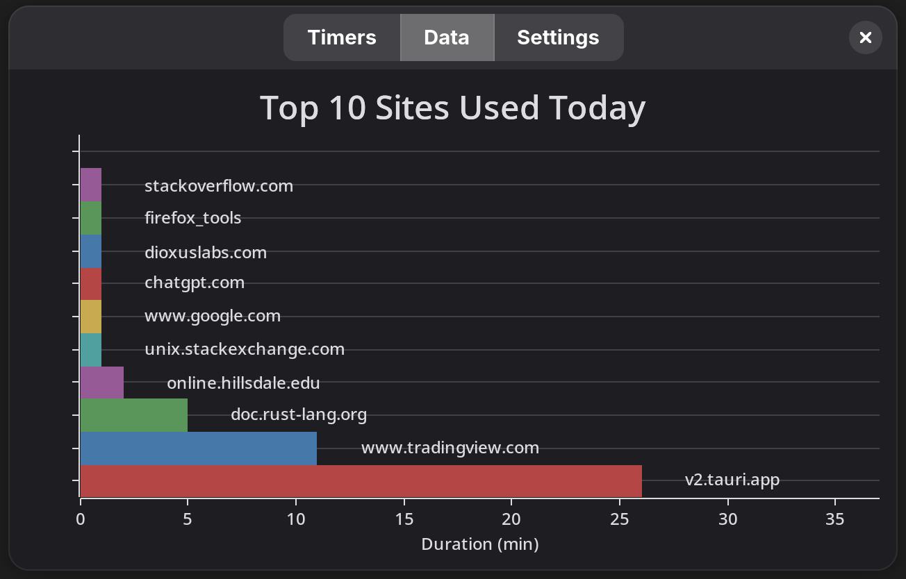
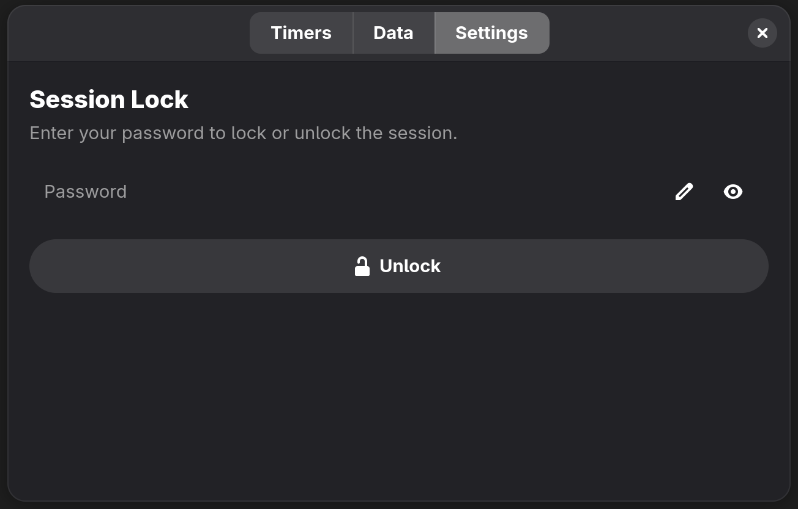

# Activity Warden

The Activity Warden is a comprehensive platform to monitor and oversee activity on the computer. At this point, the only supported platform is the web browser, Firefox. However, the functionality of the Activity Warden could be extended to support different types of Watchers as long as the necessary traits can be implemented.

## Timers Page:

Display the current, active timers in a list. Once the time is exceeded, the application or tab will be closed.

## Data Page:

Display the greatest ten durations spent on particular websites or applications.

## Lock Page:

Optionally, provide a password to better facilitate accountability.

## Building the Project:

To build the project, look at the `README.md` files of the respective sub-folders. Please also note that this project is developed for Linux.
